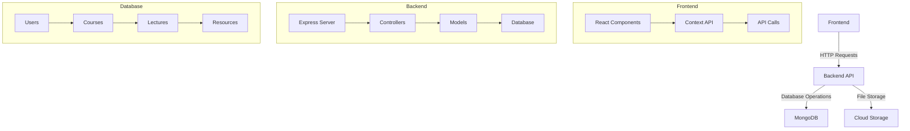

# Skill Ascend Platform

A comprehensive e-learning platform that enables students to learn and grow through interactive courses and lectures.

## Project Overview

Skill Ascend is a modern e-learning platform designed to provide an engaging and interactive learning experience. The platform allows students to enroll in courses, watch lectures, take quizzes, and track their progress. Administrators can create and manage courses, lectures, and other educational content.

## Features

### Authentication
- User registration and login
- Role-based access control (Admin/Student)
- Secure session management
- Password reset functionality

### Course Management
- Create, read, update, and delete courses
- Course categorization and search
- Course enrollment and progress tracking
- Course ratings and reviews

### Lecture System
- Video lectures with progress tracking
- Interactive quizzes
- Downloadable resources
- Lecture notes
- Real-time progress tracking

### Admin Features
- Course creation and management
- Lecture upload and organization
- User management
- Analytics and reporting
- Content moderation

### Student Features
- Course enrollment
- Progress tracking
- Quiz taking and scoring
- Resource downloads
- Course completion certificates

## Tech Stack

### Frontend
- React.js
- Vite
- Framer Motion (animations)
- React Router (navigation)
- Axios (API calls)
- IndexedDB (local storage)
- React Toastify (notifications)

### Backend
- Node.js
- Express.js
- MongoDB (database)
- Mongoose (ODM)
- JWT (authentication)
- Multer (file uploads)

### Database
- MongoDB Atlas (cloud database)
- Mongoose schemas for:
  - Users
  - Courses
  - Lectures
  - Resources
  - Quizzes
  - Progress tracking

## Project Structure

```
skill-ascend/
├── frontend/
│   ├── src/
│   │   ├── components/
│   │   ├── context/
│   │   ├── pages/
│   │   ├── assets/
│   │   └── main.jsx
│   ├── public/
│   └── package.json
├── server/
│   ├── controllers/
│   ├── models/
│   ├── routes/
│   ├── middlewares/
│   └── index.js
└── render.yaml
```

## Setup and Installation

1. Clone the repository:
   ```bash
   git clone <repository-url>
   cd skill-ascend
   ```

2. Install dependencies:
   ```bash
   # Install frontend dependencies
   cd frontend
   npm install

   # Install backend dependencies
   cd ../server
   npm install
   ```

3. Configure environment variables:
   - Create a `.env` file in the server directory
   - Add the following variables:
     ```
     PORT=5000
     MONGODB_URI=<your-mongodb-uri>
     JWT_SECRET=<your-jwt-secret>
     ```

4. Start the development servers:
   ```bash
   # Start backend server
   cd server
   npm run dev

   # Start frontend server (in a new terminal)
   cd frontend
   npm run dev
   ```

## Deployment

The project is configured for deployment on Render.com. The `render.yaml` file contains the necessary configuration for deployment.

### Build and Start Commands
- Build Command: `cd frontend && npm install && npm run build && cd ../server && npm install`
- Start Command: `cd server && node index.js`

## Architecture



## Future Improvements

1. **Enhanced Analytics**
   - Detailed student progress tracking
   - Course completion analytics
   - Learning path recommendations

2. **Social Features**
   - Discussion forums
   - Peer-to-peer learning
   - Study groups

3. **Mobile Application**
   - React Native mobile app
   - Offline learning capabilities
   - Push notifications

4. **Advanced Features**
   - AI-powered content recommendations
   - Automated grading system
   - Virtual classroom integration

5. **Performance Optimization**
   - Caching implementation
   - Lazy loading
   - Code splitting

## Contributing

1. Fork the repository
2. Create a feature branch
3. Commit your changes
4. Push to the branch
5. Create a Pull Request

## License

This project is licensed under the MIT License - see the LICENSE file for details. 